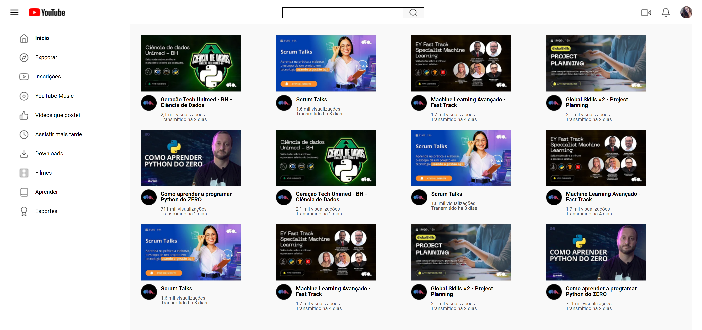

# trilha-css-desafio-03

## Sobre o Projeto
Este projeto foi desenvolvido como parte de um desafio proposto para clonar uma página do YouTube a partir de um protótipo no Figma. O foco principal do desafio era utilizar Grid Layout para organizar o layout da página, mas também envolveu a criação da página do zero utilizando HTML e CSS.

## Tecnologias Utilizadas
- **HTML**: Estruturação da página e definição dos elementos.
- **CSS**: Estilização dos elementos e uso do Grid Layout e também do FlexBox para o layout.

## Objetivos do Projeto
- Praticar a implementação de layouts com o Grid.
- Aprofundar conhecimentos em HTML e CSS.
- Reproduzir fielmente um design proposto no Figma.

## Características do Projeto
- **Grid Layout**: Utilizado para dar formato a nossa página.
- **FlexBox**: Utilizado para criar um layout responsivo e alinhar elementos na página.
- **HTML Semântico**: Tags semânticas foram usadas para estruturar o conteúdo de forma clara e acessível.
- **CSS Reset**: Um arquivo de reset foi importado para garantir a consistência entre diferentes navegadores.
- **Fontes Personalizadas**: Importadas do Google Fonts para melhorar a estética do texto.

## Como Usar
1. Clone o repositório para sua máquina local.
2. Abra o arquivo `index.html` em um navegador para visualizar o projeto.

## Contribuições
Contribuições são sempre bem-vindas! Se você tem alguma sugestão para melhorar o projeto, sinta-se à vontade para abrir uma issue ou enviar um pull request.

## Contato
Rodrigo Meili - @rodrigo_meili
Link do Projeto: https://rodrigomeili.github.io/trilha-css-desafio-03/
